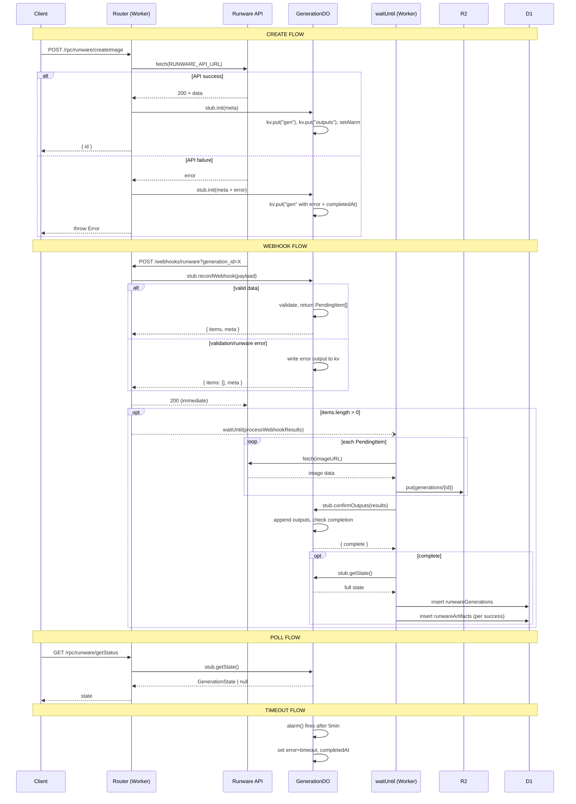

# GenerationDO Event Flow

The DO is a coordination register — it validates and tracks state but does no heavy I/O.
All CDN fetching, R2 storage, and D1 writes happen at the Worker level via `waitUntil`.

## Key Properties

- Runware gets a 200 back before any CDN fetching or R2 storage happens
- The DO is only touched twice during webhook processing: `recordWebhook` (sync KV) and `confirmOutputs` (sync KV)
- All slow I/O (CDN fetch, R2 put, D1 write) lives in the `waitUntil` Worker context
- If `waitUntil` processing crashes, the alarm fires after 5min and marks the generation as timed out
- D1 write only happens once all outputs are confirmed (generation record + artifacts together)
